# Dataloader Benchmark Results

## Configuración

- **Parquet:** data/flickr8k/processed/flickr8k_small.parquet
- **Batch Size:** 16
- **Num Workers:** 8
- **Prefetch Factor:** 2
- **Pin Memory:** True
- **Device:** cuda
- **Warmup Iters:** 10
- **Measure Iters:** 200

## Resultados

- **Throughput:** 2004.81 imgs/s
- **Tiempo promedio por batch:** 7.98 ms
- **Tiempo P50 por batch:** 1.24 ms
- **Tiempo P95 por batch:** 32.73 ms
- **GPU Util promedio (dmon):** 0.00%

## SLOs

- Throughput ≥ 300: ✅ PASS
- GPU util ≥ 85.0%: ❌ FAIL

## Calidad de datos (QC)

- **Filas:** 1500
- **Decodificación de imagen (muestra 512):** 100.00% OK
- **Duplicados en `image_id`:** 0.00%

**Caption (longitud de string crudo)**

- media: 293.7 | P10: 233 | P50: 290 | P90: 359 | % vacías: 0.00%

**Nulos por columna**

| Columna | % Nulos |
|---|---:|
| `image_id` | 0.00% |
| `caption` | 0.00% |
| `image` | 0.00% |

## Muestras (Original vs Transformada)

> La transformada muestra exactamente lo que entra al modelo (Resize + CenterCrop + Normalize invertido para visualización).

<table>
<tr>
<td style="vertical-align:top; padding:10px; text-align:center;">
<b>2991993027_36ac04e9a0.jpg</b>

Original
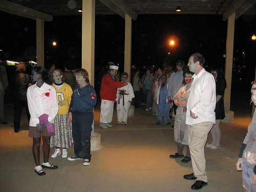
&nbsp;&nbsp;

Transformada
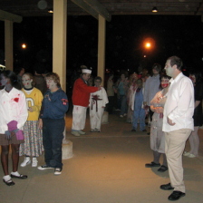

<i>A group of people dressed as zom</i>
</td>
<td style="vertical-align:top; padding:10px; text-align:center;">
<b>3712923460_1b20ebb131.jpg</b>

Original
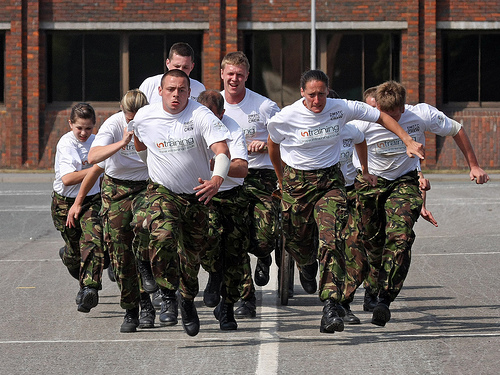
&nbsp;&nbsp;

Transformada
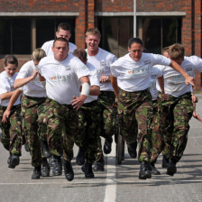

<i>a bunch of people in camo pants </i>
</td>
</tr>
<tr>
<td style="vertical-align:top; padding:10px; text-align:center;">
<b>617038406_4092ee91dd.jpg</b>

Original
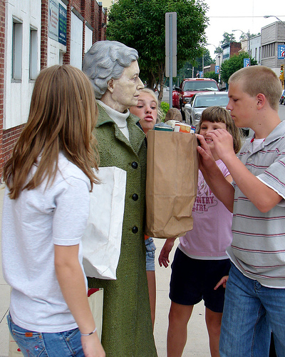
&nbsp;&nbsp;

Transformada
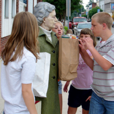

<i>A group of people gathering arou</i>
</td>
<td style="vertical-align:top; padding:10px; text-align:center;">
<b>3015898903_70bebb8903.jpg</b>

Original
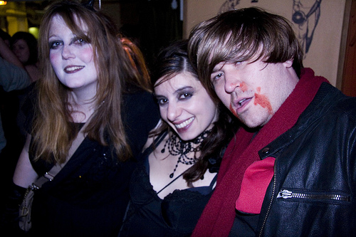
&nbsp;&nbsp;

Transformada
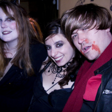

<i>A man and 2 women in dark clothi</i>
</td>
</tr>
<tr>
<td style="vertical-align:top; padding:10px; text-align:center;">
<b>2765747519_2b851e01d6.jpg</b>

Original
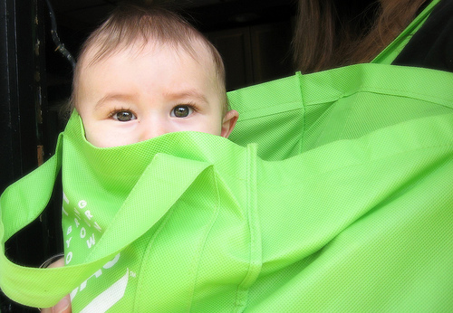
&nbsp;&nbsp;

Transformada
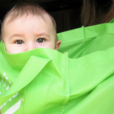

<i>A baby in a green bag peeks out </i>
</td>
<td style="vertical-align:top; padding:10px; text-align:center;">
<b>2218519240_cac5aab53c.jpg</b>

Original
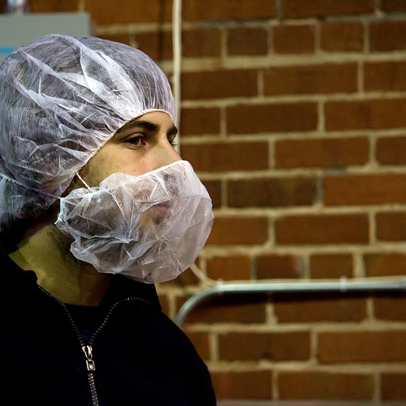
&nbsp;&nbsp;

Transformada

<i>A man is wearing protective hair</i>
</td>
</tr>
<tr>
<td style="vertical-align:top; padding:10px; text-align:center;">
<b>2369452202_8b0e8e25ca.jpg</b>

Original
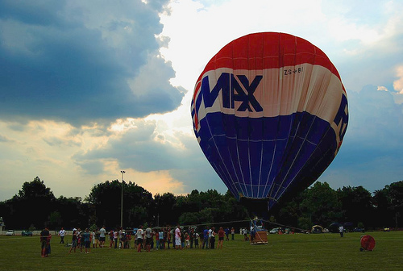
&nbsp;&nbsp;

Transformada
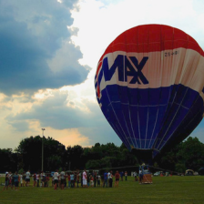

<i>A crowd of people is standing ar</i>
</td>
<td style="vertical-align:top; padding:10px; text-align:center;">
<b>241346215_037e18403a.jpg</b>

Original
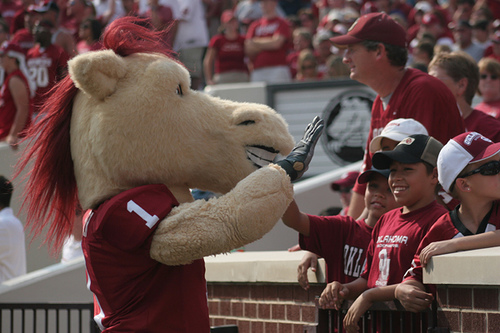
&nbsp;&nbsp;

Transformada
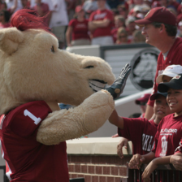

<i>A horse mascot gives high fives </i>
</td>
</tr>
</table>

## Notas y Observaciones

- El benchmark **sí** incluye el tiempo de pedir el batch al DataLoader y la transferencia a GPU.
- Se realizó warmup para estabilizar mediciones.
